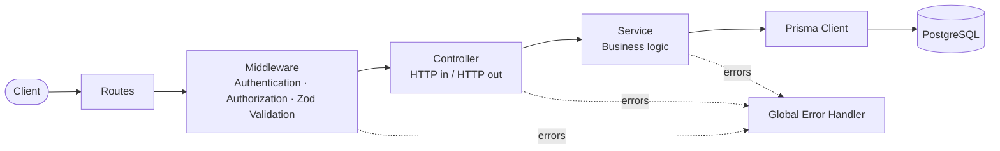
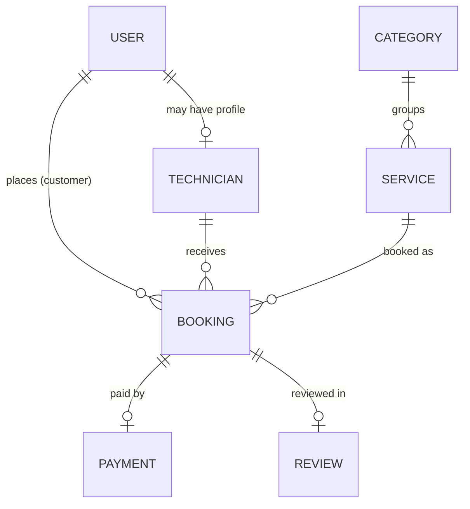
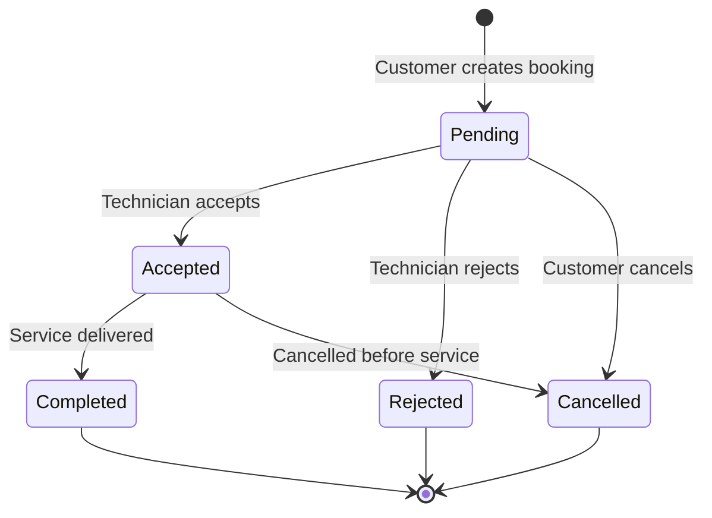

<div align="center">

# 🔧 Amar Karigor

### A production-style REST API for a home services marketplace

Connecting customers with skilled technicians for plumbing, electrical work, cleaning, painting, appliance repair, and more.


**[🌐 Live API](https://amar-karigor-home-services-server.vercel.app/)** · **[📬 Postman Collection](./postman_collection)** · **[🏗️ Architecture](#️-architecture)** · **[🧠 Tech Decisions](#-tech-stack--why-i-chose-it)**

</div>

---

## 📌 Overview

**Amar Karigor** ("My Technician" in Bangla) is a backend for a two-sided marketplace. Customers discover and book technicians; technicians manage their services, availability, and incoming requests; admins oversee the entire platform.

The goal was not just to make endpoints work, but to build a backend the way it would be built on a real team: **clear module boundaries, role-based security, validated input, consistent error handling, and a relational data model that protects data integrity.**

### 💡 What this project demonstrates

| Skill | Where to see it |
|---|---|
| Designing a scalable, maintainable backend structure | [Architecture](#️-architecture) · `src/modules/*` |
| Authentication & role-based authorization (3 roles) | `src/modules/auth` · `src/middleware` |
| Relational data modeling & migrations | `prisma/schema.prisma` |
| Input validation and type safety end to end | Zod schemas + TypeScript |
| Business workflows (booking lifecycle, payments, reviews) | `src/modules/booking` · `payment` · `review` |
| Deployment & build tooling | Vercel + `tsup` · `vercel.json` |
| API documentation & testability | `postman_collection/` |
| Making and justifying technical trade-offs | [Tech Decisions](#-tech-stack--why-i-chose-it) |

---

## 🌐 Live API

The backend is deployed and available at:

**https://amar-karigor-home-services-server.vercel.app**

Import the collection from [`postman_collection/`](./postman_collection) to try every endpoint quickly.

---

## 🚀 Features

### 👤 Customer
- Register, log in, and manage their profile
- Browse services and view technician profiles
- Book a service with a technician
- View, track, and cancel bookings
- Pay for bookings
- Leave reviews and ratings after a completed service

### 👨‍🔧 Technician
- Create and manage a professional profile
- Manage offered services and availability
- View incoming booking requests and customer details
- Accept or reject bookings, and update booking status

### 🛡️ Admin
- Manage users, technicians, services, and categories
- Oversee all bookings, payments, and reviews
- Manage platform-wide data

### ⚙️ Platform
- 🔐 JWT authentication and role-based access control (RBAC)
- 🔒 Password hashing with bcrypt
- ✅ Request validation with Zod
- ❌ Centralized error handling
- 🗄️ PostgreSQL + Prisma ORM with migrations
- 📬 Postman collection for API exploration

---

## 🏗️ Architecture

> **Modular Monolith with a layered structure (Route → Controller → Service → Data), organized by feature.**

### The big picture



### What each layer is responsible for

| Layer | Responsibility | Deliberately does **not** |
|---|---|---|
| **Routes** | Map URLs and HTTP methods to handlers; attach middleware | Contain logic |
| **Middleware** | Cross-cutting concerns: JWT auth, role checks, request validation | Know about business rules |
| **Controller** | Read the request, call a service, shape the response | Talk to the database |
| **Service** | Business rules and workflows (e.g. who may cancel a booking) | Know about `req` / `res` |
| **Prisma** | Type-safe data access to PostgreSQL | Contain business decisions |

Because services never touch `req`/`res`, business logic stays **framework-independent and easy to unit test**.

### Why this architecture?

**1. Feature-based modules (`modules/booking`, `modules/payment`, ...)**
Each domain owns its routes, controller, and service in one folder. Everything about "payments" lives in one place, so a new developer can find, understand, and change a feature without hunting through the whole codebase. Adding a new feature means adding a new folder, not editing five different ones.

**2. Layered separation of concerns**
HTTP handling, business rules, and data access change for different reasons. Keeping them apart means changes stay small and local: swapping a validation rule doesn't risk the database layer, and changing a query doesn't touch the API contract.

**3. Modular monolith: one deployable unit**
A single deployment keeps operations simple and lets related actions (such as a booking and its payment) share consistent database transactions, with no network hops between services.

### Why not something else?

| Alternative | Why I didn't choose it |
|---|---|
| **Microservices** | Adds real cost (service discovery, distributed transactions, per-service deployment, observability) with no scaling need at this stage. My module boundaries are clean enough that any module *could* be extracted into its own service later. |
| **Flat MVC (`controllers/`, `services/`, `models/` folders at the top level)** | Fine for small apps, but one feature ends up scattered across many folders as the project grows. Feature folders scale better. |
| **Clean / Hexagonal architecture with repository interfaces** | Excellent for complex domains, but heavy ceremony for this size. Prisma already provides a typed data-access abstraction. I would adopt this if domain logic became significantly more complex. |

---

## 📂 Project Structure

```text
amar-karigor-home-services-server/
├── prisma/                     # Database schema & migrations
├── generated/                  # Generated Prisma Client
├── postman_collection/         # Importable API collection
├── src/
│   ├── config/                 # Environment & app configuration
│   ├── lib/                    # Shared libraries (e.g. Prisma client)
│   ├── middleware/             # Auth, role guard, validation, error handling
│   ├── modules/                # ← Feature modules (one folder per domain)
│   │   ├── admin/
│   │   ├── auth/
│   │   ├── booking/
│   │   ├── payment/
│   │   │   ├── payment.controller.ts
│   │   │   ├── payment.routes.ts
│   │   │   └── payment.service.ts
│   │   ├── review/
│   │   ├── service/
│   │   ├── technician/
│   │   └── user/
│   ├── utils/                  # Reusable helpers
│   ├── app.ts                  # Express app: middleware & route registration
│   └── server.ts               # Entry point
├── prisma.config.ts            # Prisma configuration
├── tsup.config.ts              # Build configuration
├── tsconfig.json
└── vercel.json                 # Deployment configuration
```

> Every module follows the same **`*.routes.ts` → `*.controller.ts` → `*.service.ts`** convention, so once you understand one module you understand them all.

---

## 🧰 Tech Stack & Why I Chose It

I chose each tool for a specific reason and looked at the alternatives before deciding.

| Technology | Role | Why I chose it | What I considered |
|---|---|---|---|
| **TypeScript** | Language | Catches bugs at compile time, gives autocomplete and self-documenting code, and makes refactoring safe as the codebase grows. | Plain JavaScript: faster to start, but errors surface at runtime. |
| **Node.js** | Runtime | One language across the stack, a huge ecosystem, and a non-blocking I/O model that suits an API-heavy, I/O-bound workload like this one. | Java/Spring, Django: powerful, but I wanted to go deep in the JS/TS ecosystem. |
| **Express.js** | Web framework | Minimal and unopinionated, so I designed the architecture myself instead of inheriting one. Mature, well-documented, and the industry's most common Node framework. | **NestJS** gives structure out of the box but with more boilerplate and abstraction. **Fastify** is faster, but Express's ecosystem and familiarity won for this project. |
| **PostgreSQL** | Database | The data is inherently **relational** (users ↔ technicians ↔ services ↔ bookings ↔ reviews ↔ payments). Postgres provides foreign keys, constraints, and ACID transactions, which matter for bookings and payments. | **MongoDB**: flexible schemas, but I'd be re-implementing joins and integrity rules in application code. |
| **Prisma ORM** | Data access | Type-safe queries generated from a single schema, readable migrations, and excellent developer experience. Types flow from DB → service → controller. | **TypeORM / Sequelize**: more boilerplate and weaker type inference. **Drizzle**: great, but Prisma's tooling and migrations fit my workflow. **Raw SQL**: full control but no type safety. |
| **@prisma/adapter-pg** | DB driver adapter | Connects Prisma through the native `node-postgres` driver, giving explicit control over the connection pool, which matters in a serverless environment. | Default Prisma engine connection. |
| **JWT** | Authentication | **Stateless**: no server-side session store to maintain, which fits serverless hosting where there is no sticky server memory. | **Server sessions** need a shared store like Redis. I'd add refresh tokens/revocation if the app needed instant logout everywhere. |
| **bcryptjs** | Password hashing | Salted, deliberately slow hashing so leaked hashes are expensive to crack. Pure JavaScript, so there are no native-compile problems on serverless platforms. | **argon2** is a strong modern option; bcrypt is proven and widely supported. |
| **Zod** | Validation | Schema-first validation with **TypeScript types inferred from the same schema**, so runtime validation and compile-time types can never drift apart. | **Joi**: no first-class TS inference. **class-validator**: decorator-based, suited to NestJS-style classes. |
| **http-status** | Utilities | Named status codes instead of "magic numbers" (`httpStatus.CREATED` vs `201`), so code reads clearly. | Hard-coded numbers. |
| **dotenv** | Configuration | Keeps secrets and environment-specific values out of the codebase (12-factor style). | Hard-coded config. |
| **tsup** | Build tool | Fast, zero-config bundling of the TypeScript source into deployable output. | `tsc` alone (slower, no bundling), Webpack (overkill for a backend). |
| **Vercel** | Hosting | Fast, free-tier-friendly deployment straight from Git, with an always-available public URL for demos. | Traditional VPS/Docker hosting (more control, more ops work). |

---

## 🗄️ Data Model

PostgreSQL is the source of truth, accessed exclusively through Prisma. Core relationships:



> See [`prisma/schema.prisma`](./prisma/schema.prisma) for the full schema.

---

## 📅 Booking Lifecycle

Bookings are the heart of the platform, and each status change is controlled by role and business rules.



After completion, the customer can **pay** and **leave a review**, which feeds the technician's rating.

---

## 🔐 Authentication & Authorization

```text
Register / Login ──► bcrypt password check ──► JWT issued
                                                  │
Every protected request ──► verify JWT ──► check role ──► controller
```

| Role | Access |
|---|---|
| 👤 **Customer** | Own profile, bookings, payments, and reviews |
| 👨‍🔧 **Technician** | Own profile, services, availability, and incoming bookings |
| 🛡️ **Admin** | Platform-wide management |

Authorization is enforced in **middleware**, so no route can accidentally forget a check inside its business logic.

---

## 🔒 Security Practices

- Passwords are **hashed and salted with bcrypt**, never stored in plain text
- **JWT-based** authentication on protected routes
- **Role-based authorization** enforced at the middleware layer
- **Every request body is validated with Zod** before reaching business logic
- **Centralized error handling** returns consistent responses and avoids leaking internals
- Secrets live in **environment variables**, never in the repository

---

## 📡 API Modules

| Module | Base path | Purpose |
|---|---|---|
| Auth | `/auth` | Register, login, token issuing |
| Users | `/users` | Customer profile management |
| Technicians | `/technicians` | Technician profiles, availability |
| Services | `/services` | Service catalog and categories |
| Bookings | `/bookings` | Create, manage, and update bookings |
| Payments | `/payments` | Booking payments |
| Reviews | `/reviews` | Ratings and feedback |
| Admin | `/admin` | Administrative operations |

Protected endpoints require a valid JWT and the appropriate role. The full list of requests is available in the [Postman collection](./postman_collection).

---

## ⚙️ Getting Started

### Prerequisites
- Node.js 18+
- A PostgreSQL database (local or hosted)

### 1. Clone the repository
```bash
git clone <https://github.com/ahsanrafi501/amar-karigor-home-services-server.git>
cd amar-karigor-home-services-server
```

### 2. Install dependencies
```bash
npm install
```

### 3. Configure environment variables
Create a `.env` file in the project root:

```env

PORT=8000
DATABASE_URL="postgres://********/postgres?sslmode=require"
APP_URL=http://localhost:8000
BCRYPT_SALT_ROUNDS=**


JWT_ACCESS_SECRET=add secret
JWT_REFRESH_SECRET=add secret
JWT_ACCESS_EXPIRES_IN = **
JWT_REFRESH_EXPIRES_IN= **


SSL_COMMERZ_STORE_ID=**
SSL_COMMERZ_STORE_PASSWORD=**

```

### 4. Generate the Prisma Client
```bash
npx prisma generate
```

### 5. Run database migrations
```bash
npx prisma migrate dev
```

### 6. Start the development server
```bash
npm run dev
```

The API is now running at `http://localhost:8000`.

### Build for production
```bash
npm run build
```

---

## ☁️ Deployment

The API is deployed on **Vercel**, configured through `vercel.json`. The TypeScript source is bundled with **tsup** for a fast, reliable build. Because JWT authentication is stateless, the API works naturally in a serverless environment.

---

## ⚖️ Engineering Trade-offs I'm Aware Of

Good engineering means knowing the limits of your own decisions:

- **Stateless JWT** is simple and scalable, but tokens can't be revoked instantly. A production system would add refresh tokens and a revocation strategy.
- **Serverless + relational DB** requires care with connection limits, which is why I use a driver adapter and would use a connection pooler as traffic grows.
- **Modular monolith** trades independent scaling for simplicity. The clean module boundaries keep the door open to extracting services later.

---

## 🛣️ Roadmap

- [ ] Automated tests (unit tests for services, integration tests for routes)
- [ ] OpenAPI / Swagger documentation
- [ ] Rate limiting and additional security headers
- [ ] Pagination, filtering, and search across list endpoints
- [ ] CI pipeline with GitHub Actions
- [ ] Dockerized local development
- [ ] Refresh tokens and token revocation
- [ ] Caching for frequently read data

---

## 🎯 Project Goal

To build a reliable digital marketplace where customers can easily find and book skilled technicians for everyday home services, using a backend that is **maintainable, secure, and ready to scale.**

---

## 👨‍💻 Author

**Ahsan Habib**
Software Engineering Student · Bangladesh

🔗 GitHub: [github.com/your-username](https://github.com/ahsanrafi501)
💼 LinkedIn: [linkedin.com/in/your-profile](https://www.linkedin.com/in/dewan-ahsan-habib/)
📧 Email: ahsanhabib81102@gmail.com

---

## 📄 License

This project is developed for educational and portfolio purposes.